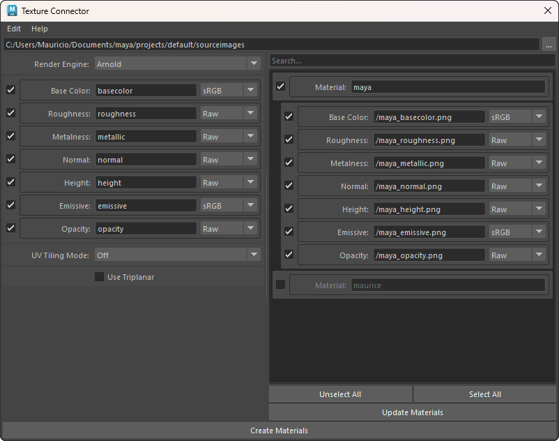

# texture-connector
Texture Connector is a tool for Autodesk Maya that automates the assignment and connection of textures to 
materials



## Table of Contents
- [Installation](#installation)
- [Shelf Button Creation](#shelf-button-creation)
- [Compatibility](#compatibility)

## Installation
1. Download the project:
   - Click the `<> Code` button on GitHub
   - Select the `Download ZIP` option to download the compressed file
2. Extract the ZIP file:
   - Extract the downloaded ZIP file
3. Move the files to Maya’s `scripts` folder:
   - Open the extracted folder named `texture-connector-master`
   - Copy the `texture_connector` folder into Maya’s `scripts` directory
     - On Windows: `C:\Users\<YourUsername>\Documents\maya\scripts`
     - On macOS: `~/Documents/maya/scripts`
     - On Linux: `~/maya/scripts`
   - Paste the `texture_connector` folder

## Shelf Button Creation
1. Open the Script Editor in Maya
2. Create a new Python tab
3. Copy the following Python code
    ```python 
    from texture_connector import TextureConnectorUI
    
    TextureConnectorUI.display()
    ```
4. From the Script Editor main menu select **File->Save Script to Shelf**

## Compatibility
This tool is compatible with the following versions of Maya and render engines:

### Maya Versions:
- [x] Maya 2022
- [x] Maya 2023
- [x] Maya 2024
- [x] Maya 2025

### Supported Render Engines:
- [x] Arnold 
- [x] Redshift
- [ ] RenderMan
- [x] V-Ray 
